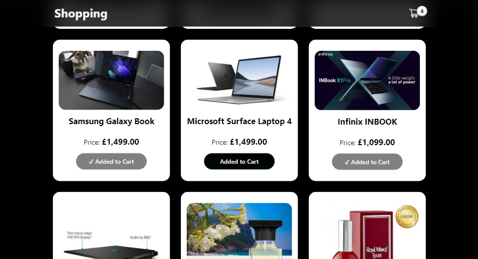

# Shopping Cart 🛒 with React.js & TypeScript

A shopping cart that allows you 

- store products/items into your cart
- click the product image to visit the individual product page for more details about the product
- Route to your cart page by clicking the cart icon at the top right of the page

### Screenshot

### Links

- Live Site URL: [Vercel](https://shopping-cart-dun-three.vercel.app/)

### Built with

- Semantic HTML5 markup
- SASS
- React.js
- React Custom Hooks
- useLocalStorageState Hook - to store the products in the local storage of the browser
- TypeScript
- Mobile-first workflow

## Author

- LinkedIn - [@JeremiahChinwe](https://www.linkedin.com/in/jeremiah-chinwe-057180268)
- Twitter - [@jeremiahchinwe](https://www.twitter.com/jeremiahchinwe)

